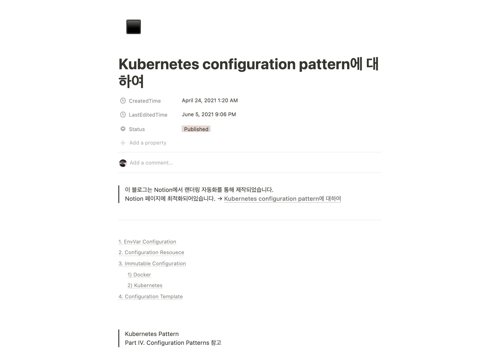
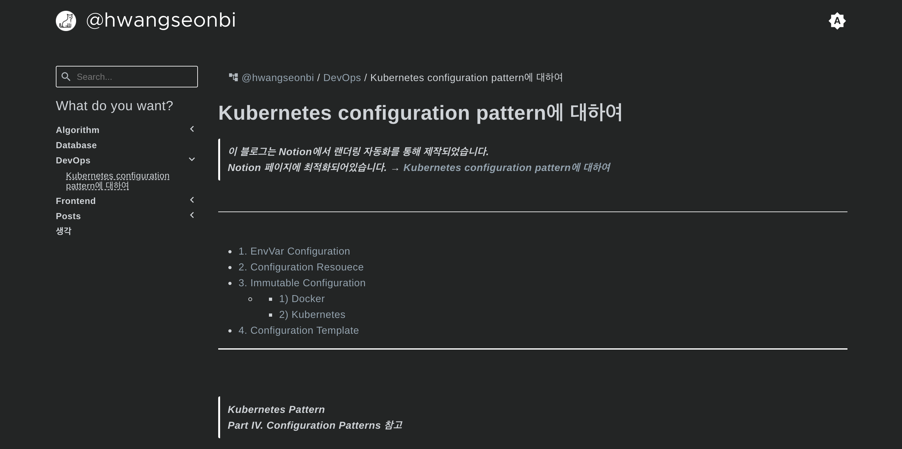
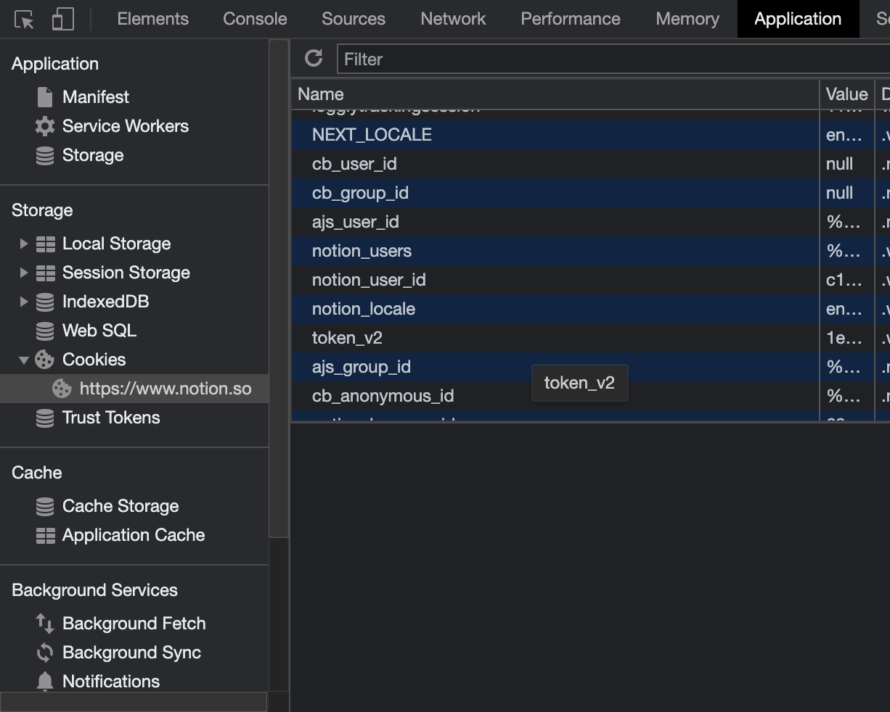
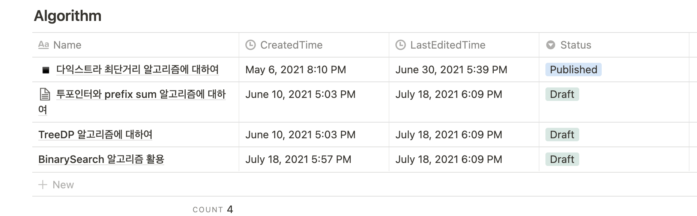
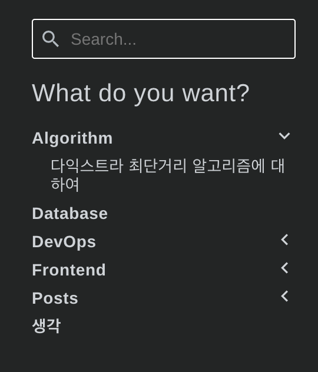
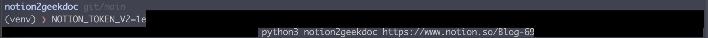
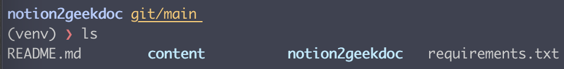

# notion2geekdoc
notion2geekdoc은 Notion에 작성한 글을 Hugo 정적 블로그로 변환시켜줍니다. 테마는 [Hugo Geekdoc Theme](https://github.com/thegeeklab/hugo-geekdoc) 를 사용합니다.


Notion | Blog
------------ | -------------
 | 

#사용방법

---

##준비물
이 패키지를 실행하기 전에 준비해야할 것들이 있습니다.

###1. Notion 토큰

notion2geekdoc은 내부적으로 [notion-py](https://github.com/jamalex/notion-py) 를 사용합니다. [notion-py](https://github.com/jamalex/notion-py) 는 당신의 공개 Notion 페이지에서 요소들을 가져오기위해 개인 토큰을 사용합니다. 토큰은 자신의 notion 페이지를 로드할 때 개발자도구를 통해 쿠키를 확인하여 얻을 수 있습니다. `token_v2` 값이 바로 그것입니다.


###2. Root Page

Root Page는 테이블로만 이루어져야합니다. 각 테이블은 블로그의 카테고리가 됩니다.

Notion | Blog
------------ | -------------
 | 


테이블 속성은 반드시 아래 규칙을 따라야 합니다.

Property Type | Property Name | ETC
------------ | ------------- | -------------
 Title| Name
Created Time | CreatedTime
Last edited time | LastEditedTime
Select |Status  | ```Published``` 또는 ```Draft```가 되어야 합니다.


##실행

###의존성 설치
```
pip3 install -r requirements.txt
```

###실행
`NOTION_TOKEN_V2` 환경변수로 토큰을 전달합니다.
```
NOTION_TOKEN_V2=<NOTION_TOKEN_V2> python3 notion2geekdoc <NOTION_ROOT_PAGE_URL>
```




`content` 디렉토리가 생성된 것을 확인할 수 있습니다. `content` 디렉토리는 [Hugo Geekdoc Theme](https://github.com/thegeeklab/hugo-geekdoc) 에서 그대로 사용할 수 있습니다. notion2geekdoc의 역할은 여기까지입니다.   




# 자동화

github에 정적블로그를 구축해놓았다면 해당 레포지토리에서 git-flow를 정의하여 자동화할 수 있습니다.
자세한 방법은 [Notion을 Github Blog로 동기화하기](https://www.notion.so/hwangseonbi/Notion-Github-Blog-6853b939a45545308ced8fc779a2500e) 을 참고해주세요.